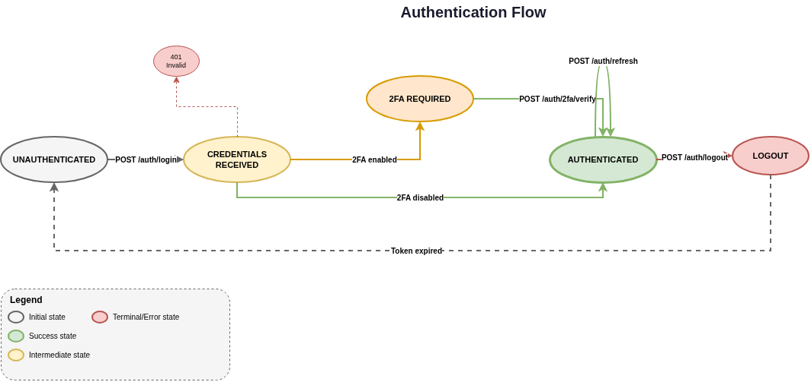
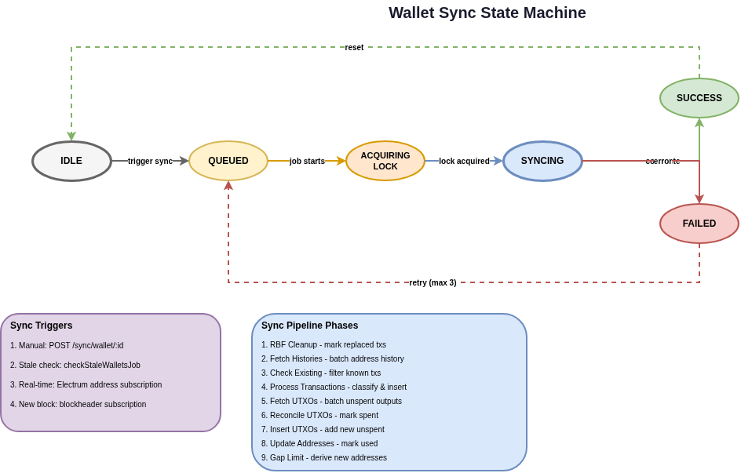
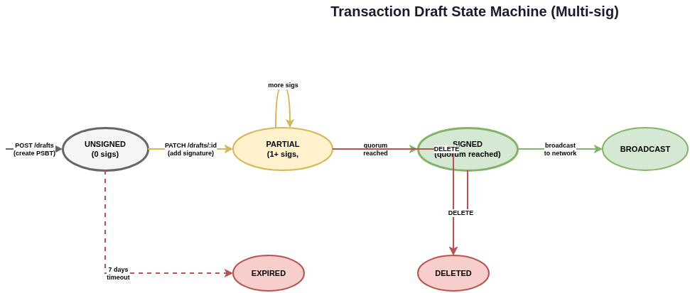
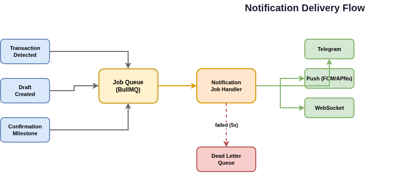
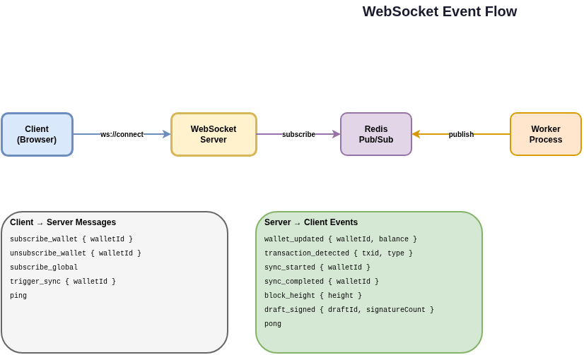
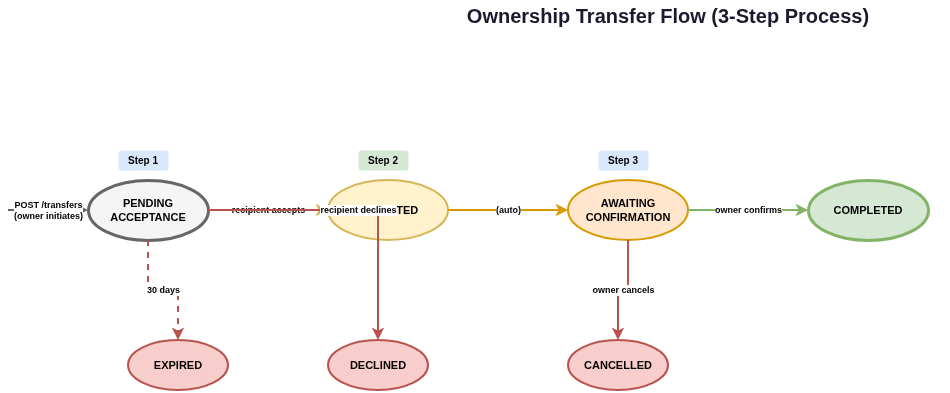

# Sanctuary State Machines

This document describes the state machines and interaction flows in Sanctuary. Use this as a reference to verify that expected behaviors exist in the codebase.

## Table of Contents

1. [Authentication Flow](#authentication-flow)
2. [Wallet Sync State Machine](#wallet-sync-state-machine)
3. [Transaction Draft Flow](#transaction-draft-flow)
4. [Notification Delivery Flow](#notification-delivery-flow)
5. [WebSocket Event Flow](#websocket-event-flow)
6. [Ownership Transfer Flow](#ownership-transfer-flow)

---

## Authentication Flow



### States

| State | Description |
|-------|-------------|
| UNAUTHENTICATED | No valid session exists |
| CREDENTIALS_RECEIVED | Username/password submitted |
| 2FA_REQUIRED | Valid credentials but 2FA verification pending |
| AUTHENTICATED | Valid session with active JWT |
| LOGOUT | Session terminated |

### Transitions

| From | To | Trigger | Handler |
|------|-----|---------|---------|
| UNAUTHENTICATED | CREDENTIALS_RECEIVED | POST /auth/login | `server/src/api/routes/auth.ts` |
| CREDENTIALS_RECEIVED | 2FA_REQUIRED | 2FA enabled on account | `authController.login()` |
| CREDENTIALS_RECEIVED | AUTHENTICATED | 2FA disabled | `authController.login()` |
| 2FA_REQUIRED | AUTHENTICATED | POST /auth/2fa/verify | `authController.verify2FA()` |
| AUTHENTICATED | AUTHENTICATED | POST /auth/refresh | `authController.refreshToken()` |
| AUTHENTICATED | LOGOUT | POST /auth/logout | `authController.logout()` |
| LOGOUT | UNAUTHENTICATED | Token expired/cleared | Frontend clears storage |

### Verification Checklist

- [ ] Invalid credentials return 401 from CREDENTIALS_RECEIVED
- [ ] 2FA bypass is not possible when enabled
- [ ] Token refresh works before expiry
- [ ] Logout invalidates refresh token
- [ ] Rate limiting prevents brute force

---

## Wallet Sync State Machine



### States

| State | Description |
|-------|-------------|
| IDLE | No sync in progress |
| QUEUED | Sync request in BullMQ job queue |
| ACQUIRING_LOCK | Attempting distributed lock (Redis) |
| SYNCING | Active sync with Electrum server |
| SUCCESS | Sync completed, returning to IDLE |
| FAILED | Error occurred, may retry |

### Sync Triggers

1. **Manual** - `POST /sync/wallet/:id` - User requests sync
2. **Stale Check** - `checkStaleWalletsJob` - Every 3 minutes for wallets older than 5 minutes
3. **Real-time** - Electrum address subscription event
4. **New Block** - Electrum blockheader subscription event

### Pipeline Phases (within SYNCING)

1. RBF Cleanup - Mark replaced transactions
2. Fetch Histories - Batch address history from Electrum
3. Check Existing - Filter out known transactions
4. Process Transactions - Classify and insert new transactions
5. Fetch UTXOs - Batch unspent outputs
6. Reconcile UTXOs - Mark spent outputs
7. Insert UTXOs - Add new unspent outputs
8. Update Addresses - Mark addresses as used
9. Gap Limit - Derive new addresses if needed

### Key Files

| Purpose | Location |
|---------|----------|
| Sync service | `server/src/services/syncService.ts` |
| Worker sync job | `server/src/worker/jobs/syncJobs.ts` |
| Distributed lock | `server/src/infrastructure/distributedLock.ts` |
| Electrum manager | `server/src/worker/electrumManager.ts` |

### Verification Checklist

- [ ] Distributed lock prevents duplicate syncs
- [ ] Lock TTL (5 min) prevents indefinite locks
- [ ] Failed syncs retry up to 3 times
- [ ] New transactions trigger notifications
- [ ] Gap limit addresses generated correctly

---

## Transaction Draft Flow



### States (Multi-sig)

| State | Description |
|-------|-------------|
| UNSIGNED | PSBT created, 0 signatures |
| PARTIAL | 1+ signatures, below quorum |
| SIGNED | Quorum reached, ready to broadcast |
| BROADCAST | Submitted to Bitcoin network |
| EXPIRED | 7 days without completion |
| DELETED | User deleted the draft |

### Transitions

| From | To | Trigger | Handler |
|------|-----|---------|---------|
| - | UNSIGNED | POST /drafts | `draftsController.create()` |
| UNSIGNED | PARTIAL | PATCH /drafts/:id (add sig) | `draftsController.addSignature()` |
| PARTIAL | PARTIAL | More signatures added | `draftsController.addSignature()` |
| PARTIAL | SIGNED | Quorum reached | `draftsController.addSignature()` |
| SIGNED | BROADCAST | POST /drafts/:id/broadcast | `draftsController.broadcast()` |
| UNSIGNED | EXPIRED | 7 days timeout | Background job |
| PARTIAL/SIGNED | DELETED | DELETE /drafts/:id | `draftsController.delete()` |

### Single-sig vs Multi-sig

- **Single-sig**: UNSIGNED → SIGNED → BROADCAST (single signature needed)
- **Multi-sig**: UNSIGNED → PARTIAL → ... → PARTIAL → SIGNED → BROADCAST

### Key Files

| Purpose | Location |
|---------|----------|
| Draft routes | `server/src/api/routes/drafts.ts` |
| PSBT handling | `server/src/services/psbtService.ts` |
| Broadcast | `server/src/services/bitcoin/broadcastService.ts` |

### Verification Checklist

- [ ] PSBT validation on create
- [ ] Signature deduplication (same signer can't sign twice)
- [ ] Quorum check accurate for m-of-n
- [ ] Broadcast verifies network connectivity
- [ ] Draft expiry cleanup runs

---

## Notification Delivery Flow



### Event Sources

| Source | Events |
|--------|--------|
| Transaction Detected | Incoming/outgoing tx during sync |
| Draft Created | New PSBT requiring signatures |
| Confirmation Milestone | 1, 3, 6 confirmations reached |

### Delivery Channels

| Channel | Handler | Configuration |
|---------|---------|---------------|
| Telegram | `telegramNotificationService.ts` | Chat ID + bot token |
| Push (FCM/APNs) | `pushNotificationService.ts` | Device token |
| WebSocket | `websocketBroadcast.ts` | Active connection |

### Queue Processing

1. Event fires → Job added to BullMQ `notifications` queue
2. Worker picks up job
3. Load user notification preferences
4. Dispatch to enabled channels
5. On failure: retry with exponential backoff (3s, 9s, 27s, 81s, 243s)
6. After 5 failures → Dead Letter Queue

### Key Files

| Purpose | Location |
|---------|----------|
| Notification service | `server/src/services/notificationService.ts` |
| Telegram integration | `server/src/services/telegramNotificationService.ts` |
| Notification jobs | `server/src/worker/jobs/notificationJobs.ts` |
| Job queue | `server/src/worker/jobQueue.ts` |

### Verification Checklist

- [ ] Notifications respect user preferences
- [ ] Failed notifications retry correctly
- [ ] DLQ receives permanently failed notifications
- [ ] Telegram markdown escaping works
- [ ] Consolidation preferences respected

---

## WebSocket Event Flow



### Architecture

```
Client (Browser) ←→ WebSocket Server ←→ Redis Pub/Sub ←→ Worker Process
```

### Client → Server Messages

| Message | Payload | Purpose |
|---------|---------|---------|
| `subscribe_wallet` | `{ walletId }` | Subscribe to wallet updates |
| `unsubscribe_wallet` | `{ walletId }` | Unsubscribe from wallet |
| `subscribe_global` | - | Subscribe to global events |
| `trigger_sync` | `{ walletId }` | Request immediate sync |
| `ping` | - | Keep connection alive |

### Server → Client Events

| Event | Payload | Trigger |
|-------|---------|---------|
| `wallet_updated` | `{ walletId, balance }` | Sync completed |
| `transaction_detected` | `{ txid, type, amount }` | New transaction found |
| `sync_started` | `{ walletId }` | Sync job began |
| `sync_completed` | `{ walletId }` | Sync job finished |
| `block_height` | `{ height }` | New block confirmed |
| `draft_signed` | `{ draftId, signatureCount }` | Signature added |
| `pong` | - | Response to ping |

### Key Files

| Purpose | Location |
|---------|----------|
| WebSocket server | `server/src/websocket/index.ts` |
| Message handlers | `server/src/websocket/handlers.ts` |
| Message schemas | `server/src/websocket/schemas.ts` |
| Broadcast utility | `server/src/websocket/broadcast.ts` |

### Verification Checklist

- [ ] Connection authenticated via JWT
- [ ] Wallet subscriptions respect access permissions
- [ ] Redis pub/sub enables multi-instance broadcast
- [ ] Ping/pong keeps connections alive
- [ ] Connection cleanup on disconnect

---

## Ownership Transfer Flow



### States

| State | Description |
|-------|-------------|
| PENDING_ACCEPTANCE | Owner initiated, waiting for recipient |
| ACCEPTED | Recipient accepted |
| AWAITING_CONFIRMATION | Waiting for owner final confirmation |
| COMPLETED | Ownership transferred |
| DECLINED | Recipient declined |
| CANCELLED | Owner cancelled |
| EXPIRED | 30 days without acceptance |

### 3-Step Process

1. **Step 1**: Owner initiates transfer (POST /transfers)
2. **Step 2**: Recipient accepts transfer
3. **Step 3**: Owner confirms transfer (finalizes)

### Transitions

| From | To | Actor | API |
|------|-----|-------|-----|
| - | PENDING_ACCEPTANCE | Owner | POST /transfers |
| PENDING_ACCEPTANCE | ACCEPTED | Recipient | PATCH /transfers/:id/accept |
| ACCEPTED | AWAITING_CONFIRMATION | (auto) | - |
| AWAITING_CONFIRMATION | COMPLETED | Owner | PATCH /transfers/:id/confirm |
| PENDING_ACCEPTANCE | DECLINED | Recipient | PATCH /transfers/:id/decline |
| AWAITING_CONFIRMATION | CANCELLED | Owner | DELETE /transfers/:id |
| PENDING_ACCEPTANCE | EXPIRED | System | 30 day timeout |

### Key Files

| Purpose | Location |
|---------|----------|
| Transfer routes | `server/src/api/routes/transfers.ts` |
| Transfer service | `server/src/services/transferService.ts` |

### Verification Checklist

- [ ] Only owner can initiate transfer
- [ ] Recipient must have account
- [ ] Owner can cancel before completion
- [ ] Recipient can decline
- [ ] Completion updates wallet ownership
- [ ] Transfer expiry cleanup runs

---

## Cross-Cutting Verification

### Security

- [ ] All API endpoints require authentication
- [ ] Wallet access checks ownership/membership
- [ ] Rate limiting on sensitive endpoints
- [ ] Input validation with Zod schemas
- [ ] SQL injection prevention (Prisma parameterization)

### Reliability

- [ ] Distributed locks prevent race conditions
- [ ] Job retries handle transient failures
- [ ] Dead letter queue captures permanent failures
- [ ] Connection pooling for database/Redis
- [ ] Graceful shutdown cleans up resources

### Observability

- [ ] Structured logging with correlation IDs
- [ ] Prometheus metrics exposed
- [ ] Health check endpoints available
- [ ] Error tracking with stack traces
